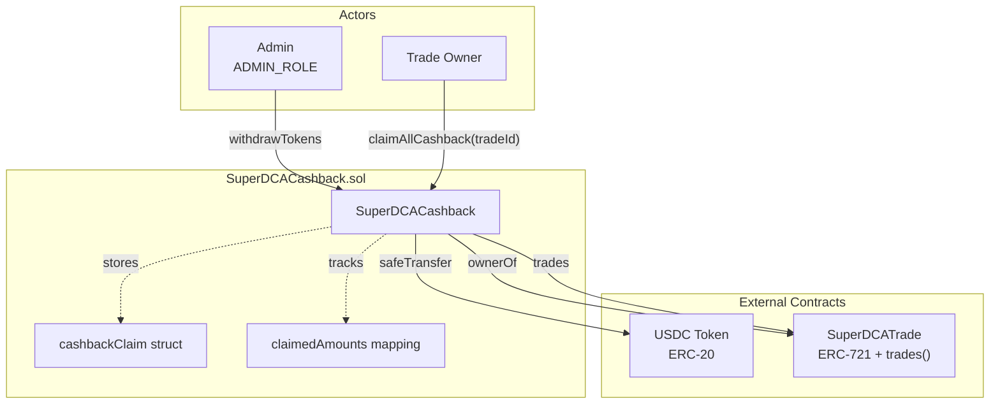
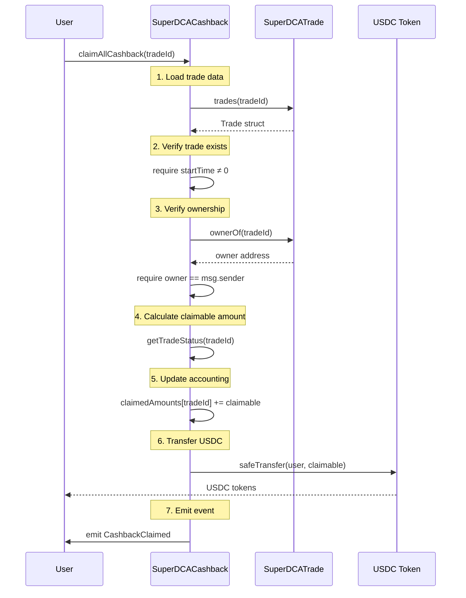

# SuperDCACashback – Whitepaper

> **Version:** 0.3 – Security Review Update  
> **Last Updated:** August 2025

---
## Table of Contents
1. Executive Summary
2. Contract Summary & Architecture
3. Storage Layout & Access Control
4. Critical Functions & User Flows
5. Economic Model & Parameterisation
6. Threat Model & Security Analysis
7. Formal Invariants & Testing
8. Risk Mitigations & Future Work

---
## 1. Executive Summary
SuperDCACashback incentivises users of the **Super DCA** protocol with USDC rebates when they execute dollar-cost-averaging strategies over time-based epochs. The contract operates with a single campaign divided into fixed-duration epochs, allowing users to claim *all* accrued rewards for a trade in one transaction. This document provides detailed technical analysis for security reviewers and auditors, addressing *why* specific design decisions were made and comprehensive threat modelling.

---
## 2. Contract Summary & Architecture

### 2.1 Contract Overview
| Item                           | Value                                  |
|--------------------------------|----------------------------------------|
| Source file                    | `src/SuperDCACashback.sol`             |
| Compiler version               | `pragma solidity 0.8.29;`              |
| Upgradeability                 | **None** – deployed once, immutable.   |
| External Tokens                | `USDC` (6 decimals, IERC20)            |
| External Contracts             | `SuperDCATrade` (ERC-721 + `trades()`) |
| Primary Admin Roles            | `DEFAULT_ADMIN_ROLE`, `ADMIN_ROLE`     |
| Campaign Model                 | Single epoch-based campaign at deployment |
| Re-entrancy Guards             | *Not required* (no external callbacks) |
| Pausing / Emergency mechanism  | **None**                               |
| Funds Held                     | USDC + arbitrary ERC-20 via `withdrawTokens` |
| Tests                          | `test/SuperDCACashback.t.sol`          |

### 2.2 System Architecture


**Key Points:**
* No circular asset flows → Re-entrancy impossible
* `SuperDCACashback` never calls untrusted code after state mutation
* Liability cap via `maxRate` prevents numeric overflows

---
## 3. Storage Layout & Access Control

### 3.1 Storage Layout
| Slot | Variable        | Type                              | Notes |
|------|-----------------|-----------------------------------|-------|
| 0    | `USDC`          | `IERC20` (immutable)              | Stable-coin used for payouts |
| 1    | `SUPER_DCA_TRADE` | `ISuperDCATrade` (immutable)    | Trade registry (ERC-721) |
| 2    | `cashbackClaim` | `CashbackClaim`                   | Single campaign configuration |
| 3+   | `claimedAmounts`| `mapping(uint256 ⇒ uint256)`      | tradeId ⇒ total claimed (USDC 6d) |

`CashbackClaim` struct (192 bytes total):
```solidity
struct CashbackClaim {
    uint256 cashbackBips;  // 0-10_000 (basis points)
    uint256 duration;      // epoch duration in seconds
    int96   minRate;       // Superfluid flow-rate lower-bound
    uint256 maxRate;       // upper-bound (uint96 size cap)
    uint256 startTime;     // start time of epoch 0
    uint256 timestamp;     // creation time (exists ≠ 0)
}
```

### 3.2 Access Control Matrix
| Function              | DEFAULT_ADMIN_ROLE | ADMIN_ROLE | Trade Owner | Any |
|-----------------------|--------------------|------------|-------------|-----|
| `withdrawTokens`      | –                  | ✓          | –           | –   |
| `claimAllCashback`    | –                  | –          | ✓           | –   |
| `getTradeStatus`      | –                  | –          | –           | ✓   |
| `getCashbackClaim`    | –                  | –          | –           | ✓   |

> `DEFAULT_ADMIN_ROLE` has the power to grant/revoke roles; keep it in a 2-of-3 multisig.

---
## 4. Critical Functions & User Flows

### 4.1 Constructor Validation
* **Campaign Configuration**: Set once at deployment
* **Validates each param** (`InvalidParams` on failure):
  1. `cashbackBips ≤ 10_000`  (100%)
  2. `maxRate ≤ type(int96).max`
  3. `minRate < maxRate`
  4. `duration > 0`
* **On success**: stores campaign configuration and sets `timestamp`

### 4.2 `claimAllCashback(tradeId)` – Complete Flow



### 4.3 Cashback Calculation Formula
```solidity
// Step 1: Cap the flow-rate
uint256 effectiveFlowRate = min(trade.flowRate, claim.maxRate);

// Step 2: Calculate trade amount over epoch duration
uint256 tradeAmount = effectiveFlowRate * claim.duration;

// Step 3: Apply cashback percentage
uint256 cashbackAmount = (tradeAmount * claim.cashbackBips) / 10_000;

// Step 4: Convert from 1e18 (flow-rate) to 1e6 (USDC) decimals
cashbackAmount = cashbackAmount / 1e12;
```

### 4.4 Trade Eligibility Logic (`_isTradeValid`)
Checks performed:
1. **Flow-rate**: `trade.flowRate ≥ cashbackClaim.minRate`
2. **Trade existence**: `trade.startTime > 0`
3. **Epoch completion**: Only fully completed epochs are eligible for rewards
4. **Forfeiture rule**: If a trade ends before completing an epoch, that epoch is forfeited

### 4.5 Public Helper Functions
* **`getTradeStatus(tradeId)`**: Returns `(claimable, pending, claimed)` amounts for a trade (all in USDC, 6 decimals)
* **`getCashbackClaim()`**: Returns the campaign configuration

### 4.6 Events & Custom Errors
| Name              | Indexed Fields          | Purpose              |
|-------------------|-------------------------|----------------------|
| `CashbackClaimed` | `user`, `tradeId`, `amount` | Successful payout   |
| `TokensWithdrawn` | `token`, `to`           | Administrative sweep |

**Custom Errors**: `InvalidParams`, `NotClaimable`, `NotAuthorized` (gas-efficient reverts)

---
## 5. Economic Model & Parameterisation

### 5.1 Cashback Formula Analysis
```
cashbackAmount = min(flowRate, maxRate) × duration × completedEpochs × cashbackBips / 10_000 / 1e12
```

**Design Rationale:**
1. **Basis Points** cap ensures predictable marketing spend
2. **Duration** is fixed per epoch – simplifies UX & gas
3. **Rate Clamp** dis-incentivises whales from capturing outsized rewards
4. **Epoch-based** allows users to earn rewards over time while maintaining predictable costs
5. **Completion Requirement** ensures rewards are only paid for fully elapsed epochs, preventing gaming

### 5.2 Illustrative Example
Given parameters:
* `flowRate = 350_000_000_000_000_000` wei/s (≈ 0.35 tokens/s)
* `duration = 30 days = 2_592_000` seconds
* `cashbackBips = 50` (0.5%)
* `maxRate = 1e18` (1 token/s)
* `completedEpochs = 2` (trade ran for 60+ days)

**Calculation:**
1. `effectiveFlowRate = min(350_000_000_000_000_000, 1e18) = 350_000_000_000_000_000`
2. `tradeAmount = 350_000_000_000_000_000 × 2_592_000 × 2 = 1_814_400_000_000_000_000_000_000`
3. `cashbackAmount = 1_814_400_000_000_000_000_000_000 × 50 / 10_000 = 9_072_000_000_000_000_000_000`
4. `finalAmount = 9_072_000_000_000_000_000_000 / 1e12 = 9_072_000_000` (9.072 USDC)

---
## 6. Threat Model & Security Analysis

### 6.1 Attack Vectors & Mitigations
| Threat Category      | Vector              | Mitigation                                                      |
|----------------------|---------------------|-----------------------------------------------------------------|
| **Re-entrancy**      | ERC-20 callback     | USDC is known-safe; no external calls after state mutation      |
| **Numeric Overflow** | `rate × duration`   | `uint256` math with caps + Solidity 0.8 checks                 |
| **Double Spend**     | Calling twice       | `claimedAmounts` monotonic counter per trade                   |
| **Admin Abuse**      | Malicious withdrawal| Governance should use multisig; consider timelock              |
| **Griefing**         | ERC-721 `ownerOf` revert | Users cannot claim but funds remain safe                   |
| **Front-running**    | MEV on claims       | No MEV value in claim transactions                             |

### 6.2 Trust Assumptions
1. **USDC Contract**: Standard ERC-20, non-reverting transfers
2. **SuperDCATrade Contract**:
   - Honest implementation of `trades()` view function
   - Proper ERC-721 `ownerOf()` implementation
   - Trade data integrity (`startTime`, `endTime`, `flowRate`)

### 6.3 Failure Modes
- **SuperDCATrade Compromise**: Users cannot claim, but existing funds are safe
- **Admin Key Compromise**: All contract funds at risk via `withdrawTokens`
- **USDC Contract Issues**: Claims fail but contract logic remains intact

---
## 7. Formal Invariants & Testing

### 7.1 Security Invariants
1. **Conservation of USDC**: `Σ{CashbackClaimed.amount} ≤ deposits – withdrawals`
2. **Monotonic Claims**: `claimedAmounts[tradeId]` is non-decreasing and ≤ calculated entitlement
3. **No Overflows**: All arithmetic operations are checked (Solidity ≥0.8)
4. **Flow-rate Bounds**: `cashbackAmount` calculation cannot overflow due to `maxRate` cap
5. **Epoch Completion**: Claims only include fully completed epochs (pending epoch is excluded)
6. **Forfeiture Enforcement**: Incomplete epochs are forfeited when trades end early

### 7.2 Test Coverage Analysis
_Current coverage: 95.31% lines, 94.12% statements, 73.68% branches_

**Test Categories:**
- **Unit Tests**: Individual function behaviour
- **Fuzz Tests**: Random input validation (258 runs per test)
- **Integration Tests**: Complete user workflows
- **Access Control**: Permission verification
- **Edge Cases**: Boundary conditions and error states

**Missing Coverage Areas:**
- Some error condition branches in `_getTradeOwner`
- Complex interaction scenarios with multiple overlapping claims

---
## 8. Risk Mitigations & Future Work

### 8.1 Immediate Recommendations
* **Multisig Admin**: Use 2-of-3 or 3-of-5 multisig for `ADMIN_ROLE`
* **Deployment Configuration**: Carefully set epoch duration and flow-rate bounds
* **Balance Monitoring**: Off-chain monitoring of USDC balance vs. outstanding epochs
* **Circuit Breaker**: Consider pausable pattern for emergency situations

### 8.2 Future Enhancements
* **Batch Claims Across Trades**: Allow claiming multiple trade IDs in one transaction
* **Dynamic Parameters**: Time-based or volume-based cashback rates within epochs
* **Layer 2 Deployment**: Reduce gas costs for users
* **Automated Top-ups**: Integration with treasury management systems
* **Multiple Campaigns**: Deploy separate contracts for different campaign types

### 8.3 Deployment Checklist
- [ ] Role admin set to secure multisig
- [ ] Adequate USDC balance for expected epoch claims
- [ ] `maxRate` parameters appropriate for current flow-rates
- [ ] `startTime` and `duration` align with marketing campaign
- [ ] Cashback percentage (`cashbackBips`) set appropriately
- [ ] All tests passing: `forge test -vvv`
- [ ] Contract verified on block explorer
- [ ] Emergency procedures documented

---
## Appendix

### A. Glossary
* **Flow-rate**: Tokens per second in Superfluid continuous flow (wei/second)
* **Basis Points (bips)**: 1 bip = 0.01% (10,000 bips = 100%)
* **Super DCA**: Dollar-Cost Averaging strategy using Superfluid streams
* **Trade NFT**: ERC-721 token representing ownership of a DCA trade

### B. Interface Dependencies
```solidity
interface ISuperDCATrade {
    struct Trade {
        uint256 tradeId;
        uint256 startTime;     // timestamp
        uint256 endTime;       // timestamp (0 if active)
        int96   flowRate;      // wei per second
        uint256 startIdaIndex;
        uint256 endIdaIndex;
        uint256 units;
        uint256 refunded;
    }
    
    function trades(uint256 tradeId) external view returns (Trade memory);
    function ownerOf(uint256 tokenId) external view returns (address); // ERC-721
}
```

### C. Revision History
| Version | Date       | Author         | Notes                                   |
|---------|------------|----------------|-----------------------------------------|
| 0.1     | Jan 2025   | Protocol Team  | Epoch-based single-campaign design      |
| 0.2     | Aug 2025   | Protocol Team  | Switched to aggregated `claimAllCashback` model |
| 0.3     | Jan 2025   | Protocol Team  | Simplified to require full epoch completion for rewards |
