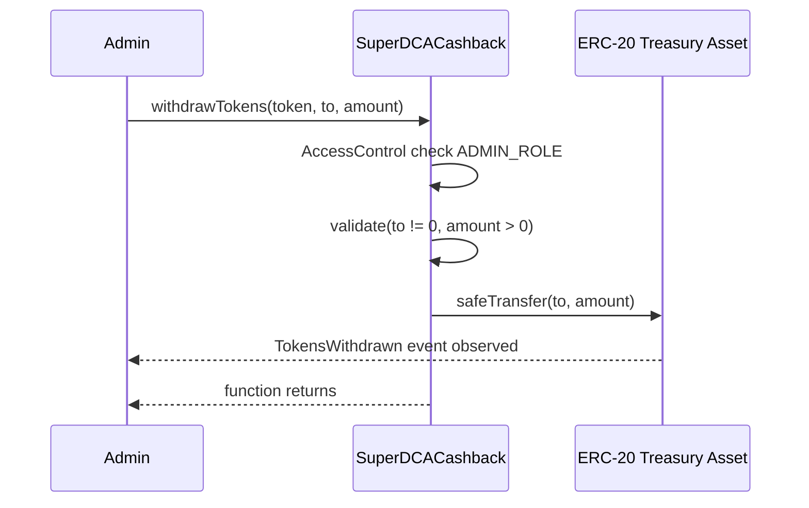

```mermaid
sequenceDiagram
    participant Admin
    participant Cashback as SuperDCACashback
    participant Token as ERC-20 Treasury Asset
    Admin->>Cashback: withdrawTokens(token, to, amount)
    Cashback->>Cashback: AccessControl check ADMIN_ROLE
    Cashback->>Cashback: validate(to != 0, amount > 0)
    Cashback->>Token: safeTransfer(to, amount)
    Token-->>Admin: TokensWithdrawn event observed
    Cashback-->>Admin: function returns
```
