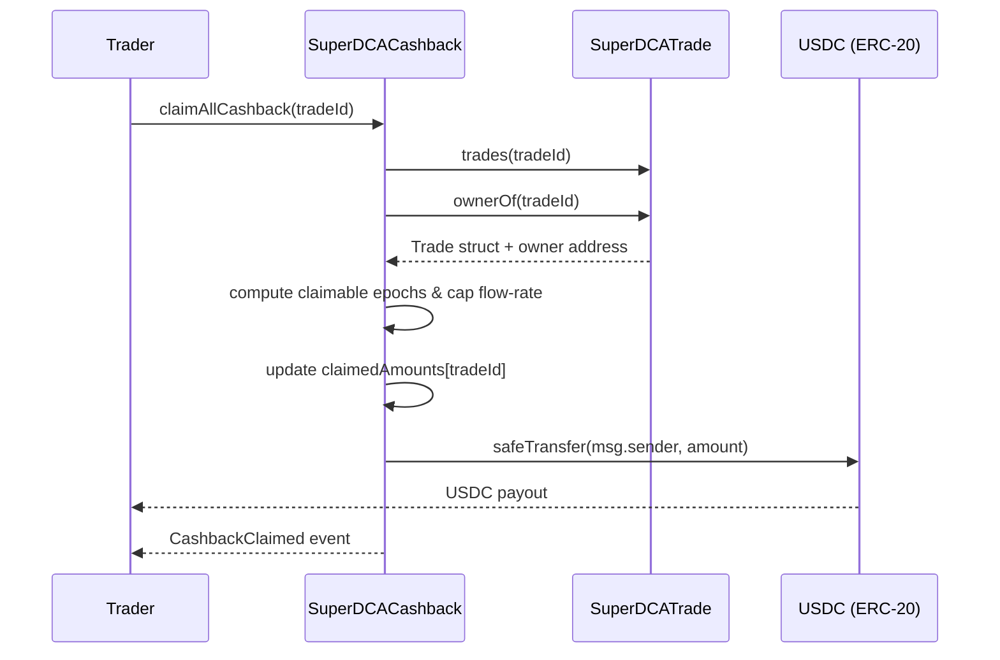

```mermaid
sequenceDiagram
    participant Trader
    participant Cashback as SuperDCACashback
    participant Registry as SuperDCATrade
    participant Token as USDC (ERC-20)
    Trader->>Cashback: claimAllCashback(tradeId)
    Cashback->>Registry: trades(tradeId)
    Cashback->>Registry: ownerOf(tradeId)
    Registry-->>Cashback: Trade struct + owner address
    Cashback->>Cashback: compute claimable epochs & cap flow-rate
    Cashback->>Cashback: update claimedAmounts[tradeId]
    Cashback->>Token: safeTransfer(msg.sender, amount)
    Token-->>Trader: USDC payout
    Cashback-->>Trader: CashbackClaimed event
```
