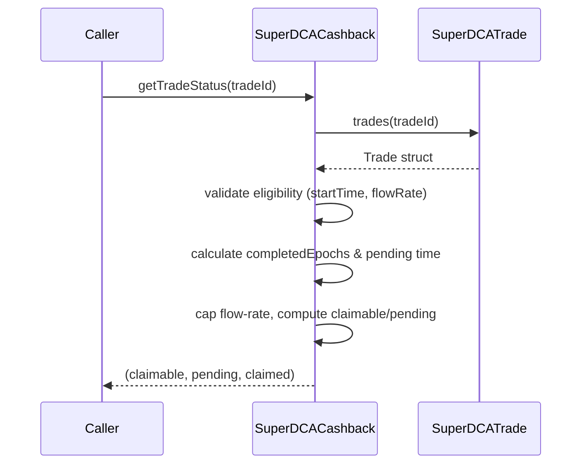

```mermaid
sequenceDiagram
    participant Caller
    participant Cashback as SuperDCACashback
    participant Registry as SuperDCATrade
    Caller->>Cashback: getTradeStatus(tradeId)
    Cashback->>Registry: trades(tradeId)
    Registry-->>Cashback: Trade struct
    Cashback->>Cashback: validate eligibility (startTime, flowRate)
    Cashback->>Cashback: calculate completedEpochs & pending time
    Cashback->>Cashback: cap flow-rate, compute claimable/pending
    Cashback-->>Caller: (claimable, pending, claimed)
```
