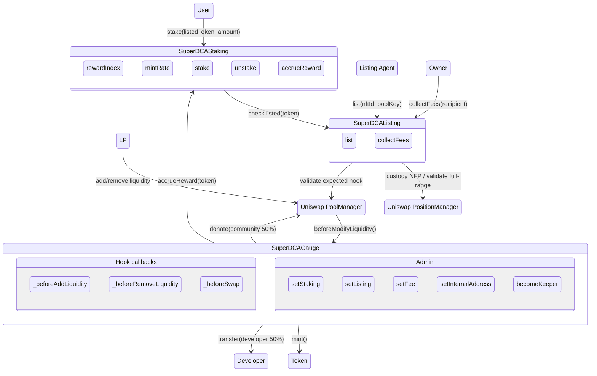
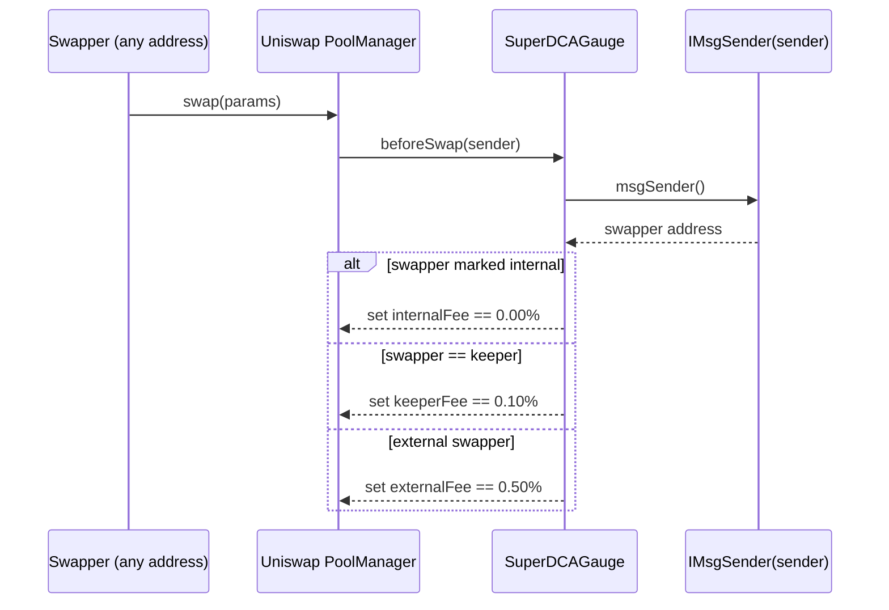

# Super DCA Gauge


<div align="center">
Part of the Super DCA Framework
<br> 
<a href="https://github.com/Super-DCA-Tech/super-dca-token">🌐 Token</a> &nbsp;|&nbsp; <a href="https://github.com/Super-DCA-Tech/super-dca-gauge">📊 Gauge</a> &nbsp;|&nbsp; <a href="https://github.com/Super-DCA-Tech/super-dca-contracts">🏊 Pool</a>
</div>

## Super DCA Gauge

Super DCA Gauge is a Uniswap v4 hook plus companion staking and listing modules that make it easy to distribute onchain emissions of the `SuperDCAToken` to eligible Uniswap v4 pools and the developer treasury. Rewards are minted by the gauge, split 50/50 between the community (donated to the pool) and the developer, and are triggered during liquidity events. The hook also enforces dynamic swap fees and supports a keeper system make Super DCA so super!

## How it works:

### 1. Deploy and configure the Gauge suite
- Deploy `SuperDCAGauge` with the DCA token and an admin (developer multisig) as the default admin.
- Deploy `SuperDCAStaking` with the DCA token and an initial `mintRate` (emissions per second). Set the gauge as the authorized caller via `setGauge`.
- Deploy `SuperDCAListing` with the Uniswap managers and the expected hook address. The owner uses it to list partner tokens via full‑range positions.
- Transfer `SuperDCAToken` ownership to the gauge so it can mint rewards. Ownership can be reclaimed later via `returnSuperDCATokenOwnership` if needed.
- Configure dynamic swap fees with `setFee` and optionally mark internal addresses (e.g., Super DCA Pools) via `setInternalAddress`.

### 2. Tokenholders list and stake
- Listing owner calls `list(nftId, poolKey)` to permanently custody a full‑range NFP and mark the paired token as eligible.
- DCA holders stake to the token’s bucket in `SuperDCAStaking` via `stake(listedToken, amount)`. Unstake at any time with `unstake`.
- The global reward index accrues over time as a function of `mintRate` and total stake; per‑token rewards are proportional to each token’s share of the total stake.

### 3. Gauge donates rewards on liquidity events and enforces fees
- When LPs add or remove liquidity, the pool manager invokes the gauge hook. The gauge syncs staking, calls `accrueReward(listedToken)`, and mints DCA.
- Minted rewards are split 50/50: the community share is donated to the pool, and the developer share is transferred to the developer address. If the pool has zero liquidity, the entire amount goes to the developer.
- On swaps, the hook sets fees dynamically: 0% for internal addresses, 0.10% for the keeper, and 0.50% for all others (values configurable by managers). Fees are applied per‑swap via Uniswap v4’s dynamic fee override flag.

When used by a protocol or DAO, emissions are funded by the DCA token’s issuance (via gauge ownership of the token). The default configuration targets a fixed reward flow (e.g., 10K DCA/month) but is fully configurable onchain via `mintRate`.

## Implementation details:

The system is composed of three non‑upgradeable contracts with clear responsibilities:

- `SuperDCAGauge` (Uniswap v4 hook)
  - Distributes rewards on liquidity events; enforces pool eligibility (must include DCA and dynamic fee flag).
  - Enforces dynamic swap fees (internal/keeper/external tiers) and holds the keeper’s up‑only deposit.
  - Key admin: `setStaking`, `setListing`, `updateManager`, `setFee`, `setInternalAddress`, `becomeKeeper`, `returnSuperDCATokenOwnership`.
- `SuperDCAStaking`
  - Tracks global `rewardIndex`, per‑token stake, and `mintRate` (DCA/sec). Only the configured gauge can call `accrueReward`.
  - Key admin: `setGauge`, `setMintRate` (owner or gauge).
- `SuperDCAListing`
  - Custodies full‑range NFPs, validates expected hook, and marks partner tokens as listed; owner can `collectFees` from locked positions.

Design properties:
- Accrual monotonicity: the global `rewardIndex` only increases when stake > 0; per‑token accounting mirrors Aave‑style index math.
- 50/50 split: donation to pools and developer transfer are equal (±1 wei rounding) when mint succeeds; accrual proceeds even if minting fails.
- Keeper rotation: `becomeKeeper(amount)` requires a strictly higher deposit and automatically refunds the previous keeper.

### Staking & distribution system



### Dynamic Fees
Super DCA is so super because it offers 0% fees for long-term orders (i.e., Super DCA Pool contracts performing DCA swaps). It also offers a reduced fee for a keeper who is staking the most DCA to the Super DCA Gauge (i.e., king of the hill staking). To make up for these reduced fees, the Super DCA Gauge offers a higher fee for external swappers (i.e., short-term traders not doing DCA).



## Usage

The repository can be used directly to deploy the system or imported into a Foundry project for integration testing and customization.

### Build and test

This project uses Foundry. Ensure you have Foundry installed, then:

```bash
cp .env.example .env  # populate OPTIMISM_RPC_URL for integration tests
forge install
forge build

# Full suite (includes Optimism mainnet integration tests)
export OPTIMISM_RPC_URL=<your_optimism_rpc_url>
forge test -vv

# Without integration tests
forge test -vv --no-match-path "test/integration/*"
```

### Spec and lint

This repo uses `scopelint` for linting and spec generation.

```bash
scopelint check   # check formatting
scopelint fmt     # apply formatting changes
scopelint spec    # generate human-readable spec from test names
```

### Documentation
- Security/design overview: `docs/security/README.md`
- Diagrams: `docs/security/diagrams/*`

## Deployment Addresses
| Network | Contract | Address |
| --- | --- | --- |
| All | Super DCA Token | 0xb1599cde32181f48f89683d3c5db5c5d2c7c93cc |
| Base | `SuperDCAGauge` | [0xBc5F29A583a8d3ec76e03372659e01a22feE3A80](https://basescan.org/address/0xBc5F29A583a8d3ec76e03372659e01a22feE3A80) |
| Optimism | `SuperDCAGauge` | [0xb4f4Ad63BCc0102B10e6227236e569Dce0d97A80](https://optimistic.etherscan.io/address/0xb4f4Ad63BCc0102B10e6227236e569Dce0d97A80) |
| Base Sepolia | `SuperDCAGauge` | [0x741810C3Fb97194dEcB045E45b9920680E1d7a80](https://sepolia.basescan.org/address/0x741810C3Fb97194dEcB045E45b9920680E1d7a80) |
| Unichain Sepolia | `SuperDCAGauge` | [0xEC67C9D1145aBb0FBBc791B657125718381DBa80](https://unichain-sepolia.blockscout.com/address/0xEC67C9D1145aBb0FBBc791B657125718381DBa80) |

## License

The code in this repository is licensed under the [Apache License 2.0](LICENSE) unless otherwise indicated.

Copyright (C) 2025 Michael Ghen
