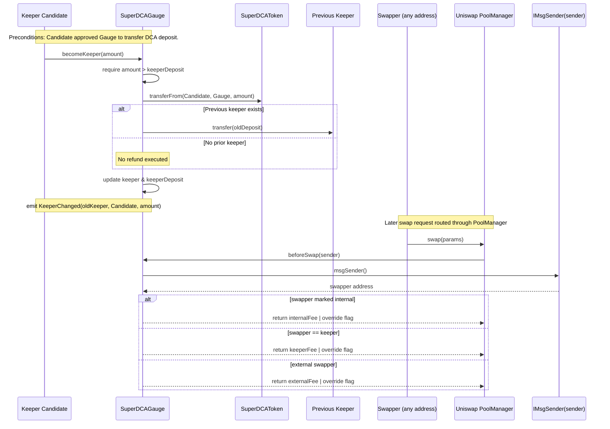

```mermaid
sequenceDiagram
    participant Candidate as Keeper Candidate
    participant Gauge as SuperDCAGauge
    participant Token as SuperDCAToken
    participant Prev as Previous Keeper
    participant Swapper as Swapper (any address)
    participant Pool as Uniswap PoolManager
    participant Proxy as IMsgSender(sender)

    Note over Candidate,Gauge: Preconditions: Candidate approved Gauge to transfer DCA deposit.
    Candidate->>Gauge: becomeKeeper(amount)
    Gauge->>Gauge: require amount > keeperDeposit
    Gauge->>Token: transferFrom(Candidate, Gauge, amount)
    alt Previous keeper exists
        Gauge->>Prev: transfer(oldDeposit)
    else No prior keeper
        Note over Gauge: No refund executed
    end
    Gauge->>Gauge: update keeper & keeperDeposit
    Note over Gauge,Candidate: emit KeeperChanged(oldKeeper, Candidate, amount)

    Note over Swapper,Pool: Later swap request routed through PoolManager
    Swapper->>Pool: swap(params)
    Pool->>Gauge: beforeSwap(sender)
    Gauge->>Proxy: msgSender()
    Proxy-->>Gauge: swapper address
    alt swapper marked internal
        Gauge-->>Pool: return internalFee | override flag
    else swapper == keeper
        Gauge-->>Pool: return keeperFee | override flag
    else external swapper
        Gauge-->>Pool: return externalFee | override flag
    end
```
