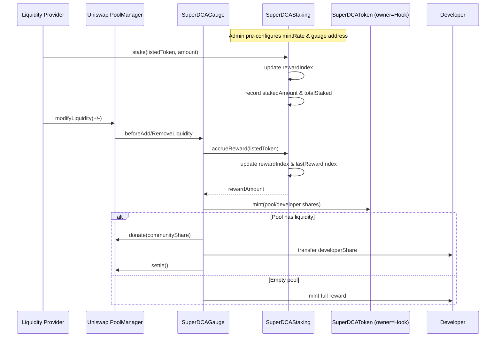

```mermaid
sequenceDiagram
    participant LP as Liquidity Provider
    participant PM as Uniswap PoolManager
    participant Hook as SuperDCAGauge
    participant Stake as SuperDCAStaking
    participant Token as SuperDCAToken (owner=Hook)
    participant Dev as Developer

    Note over Stake: Admin pre-configures mintRate & gauge address

    LP->>Stake: stake(listedToken, amount)
    Stake->>Stake: update rewardIndex
    Stake->>Stake: record stakedAmount & totalStaked

    LP->>PM: modifyLiquidity(+/-)
    PM->>Hook: beforeAdd/RemoveLiquidity
    Hook->>Stake: accrueReward(listedToken)
    Stake->>Stake: update rewardIndex & lastRewardIndex
    Stake-->>Hook: rewardAmount
    Hook->>Token: mint(pool/developer shares)
    alt Pool has liquidity
        Hook->>PM: donate(communityShare)
        Hook->>Dev: transfer developerShare
        Hook->>PM: settle()
    else Empty pool
        Hook->>Dev: mint full reward
    end
```
