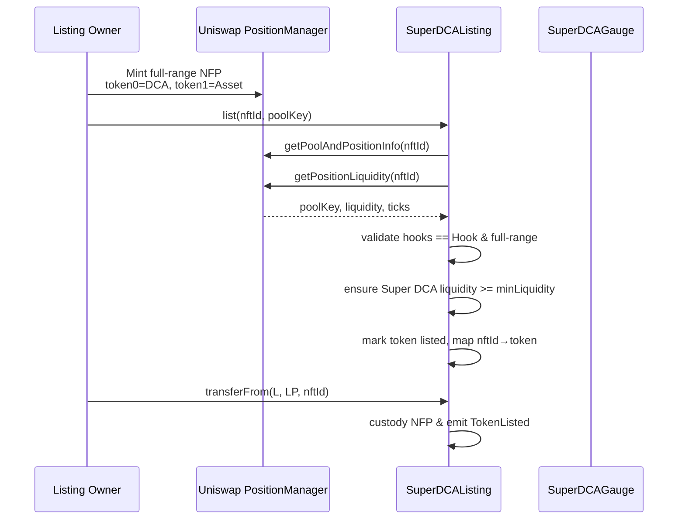

```mermaid
sequenceDiagram
    participant L as Listing Owner
    participant PM as Uniswap PositionManager
    participant LP as SuperDCAListing
    participant Hook as SuperDCAGauge

    L->>PM: Mint full-range NFP<br/>token0=DCA, token1=Asset
    L->>LP: list(nftId, poolKey)
    LP->>PM: getPoolAndPositionInfo(nftId)
    LP->>PM: getPositionLiquidity(nftId)
    PM-->>LP: poolKey, liquidity, ticks
    LP->>LP: validate hooks == Hook & full-range
    LP->>LP: ensure Super DCA liquidity >= minLiquidity
    LP->>LP: mark token listed, map nftId→token
    L->>LP: transferFrom(L, LP, nftId)
    LP->>LP: custody NFP & emit TokenListed
```
